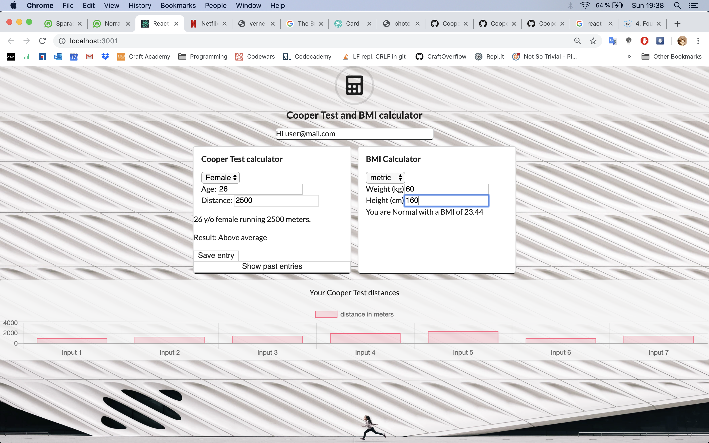

# Cooper Client in React
Made by: Miyesier Kaerman & Pia von Wachenfelt
Deployed as [CooperTest-Pia-Miyesier](https://coopertest-pia-miyesier.netlify.com) 

## Weekend-Challenge questions:
1. Where are we doing the calculation? 
    Through the module CooperCalulator in the Client/front-end side. 

2. Where do we check the result of the cooper test? - client or server/api?
    We check the result in the client and save the result data in the API. 

3. What are the pros and cons of doing it that way?
    Positives: users gets results faster than if we were to send and get data from an API. 
    Negatives: data isn't saved automaticly. 

Screenshots of what it looks like:

## Code & dependencies
This project was bootstrapped with [Create React App](https://github.com/facebook/create-react-app).
It uses a home-made API [Cooper-API-Pia-Miyesier](https://cooper-api-pia-miyesier.herokuapp.com/) created in Ruby on Rails. [GitHub of the API](https://github.com/piavW/Cooper_API_Challenge)
- Acceptance testing with Cucumber
- Component testing with Enzyme and Jest
- Uses yarn for scripts.
- Scaffold code for charts/graphs from ChartsJS - using the `react-chartsjs-2` package.

### Available Scripts
In the project directory, you can run:
- `yarn start` to run the app in the development mode. Open [http://localhost:3000](http://localhost:3000) to view it in the browser.
- `yarn run test` Launches the test runner.
- `yarn cy:open` Launches Cypress for acceptance tests. 